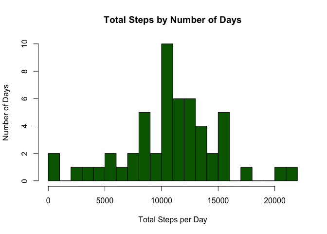
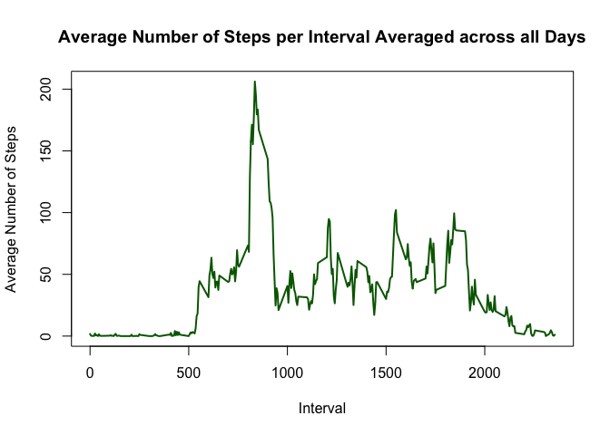
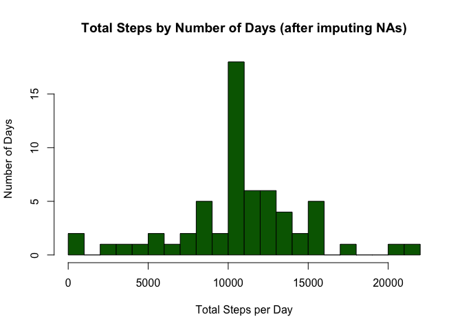
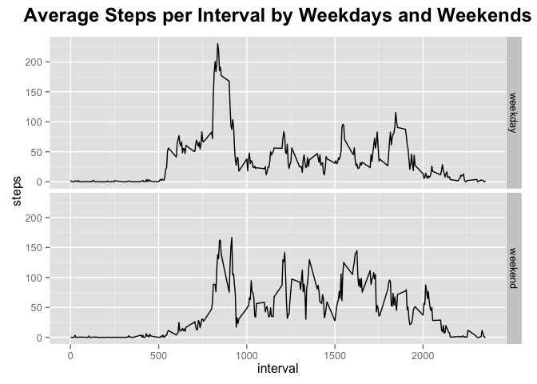

# Reproducible Research: Peer Assessment 1


## Introduction

It is now possible to collect a large amount of data about personal movement using activity monitoring devices such as a Fitbit, Nike Fuelband, or Jawbone Up. These type of devices are part of the “quantified self” movement – a group of enthusiasts who take measurements about themselves regularly to improve their health, to find patterns in their behavior, or because they are tech geeks. But these data remain under-utilized both because the raw data are hard to obtain and there is a lack of statistical methods and software for processing and interpreting the data.

This assignment makes use of data from a personal activity monitoring device. This device collects data at 5 minute intervals through out the day. The data consists of two months of data from an anonymous individual collected during the months of October and November, 2012 and include the number of steps taken in 5 minute intervals each day.

## Data

The data for this assignment can be downloaded from the course web site:

Dataset: [Activity Monitoring Data](https://d396qusza40orc.cloudfront.net/repdata%2Fdata%2Factivity.zip)

The variables included in this dataset are:

&nbsp;&nbsp;&nbsp;&nbsp;**steps:** Number of steps taking in a 5-minute interval (missing values are coded as NA)  
&nbsp;&nbsp;&nbsp;&nbsp;**date:** The date on which the measurement was taken in YYYY-MM-DD format  
&nbsp;&nbsp;&nbsp;&nbsp;**interval:** Identifier for the 5-minute interval in which measurement was taken

The dataset is stored in a comma-separated-value (CSV) file and there are a total of 17,568 observations in this dataset.


## Loading and preprocessing the data


```r
## set working directory, if necessary
#setwd("~/Coursera/RepData_PeerAssessment1")

## unzip data file
unzip("activity.zip")

## Read csv file
data <- read.csv("activity.csv")

## Show first few lines of data file
head(data)
```

```
##   steps       date interval
## 1    NA 2012-10-01        0
## 2    NA 2012-10-01        5
## 3    NA 2012-10-01       10
## 4    NA 2012-10-01       15
## 5    NA 2012-10-01       20
## 6    NA 2012-10-01       25
```

```r
## Convert the field 'date' to a date format
data$date <- as.Date(data$date, format = "%Y-%m-%d")
```

## What is mean total number of steps taken per day?

This section will address these points (missing values are ignored for this part):

1. Calculate the total number of steps taken per day

2. If you do not understand the difference between a histogram and a barplot, research the difference between them. Make a histogram of the total number of steps taken each day

3. Calculate and report the mean and median of the total number of steps taken per day


```r
## Calculate total steps per day
totsteps <- aggregate(data$steps, list(data$date), sum)

## Rename columns
totsteps <- rename(totsteps, c("Group.1"="interval", "x"="steps"))

head(totsteps)
```

```
##     interval steps
## 1 2012-10-01    NA
## 2 2012-10-02   126
## 3 2012-10-03 11352
## 4 2012-10-04 12116
## 5 2012-10-05 13294
## 6 2012-10-06 15420
```

```r
## create histogram 
hist(totsteps$steps, breaks=20, col="dark green", main="Total Steps by Number of Days", 
                 ylab="Number of Days", xlab="Total Steps per Day")
```

 

```r
## Calculate the mean number of steps per day
avg <- round(mean(totsteps$steps, na.rm=TRUE), 2)
med <- median(totsteps$steps, na.rm=TRUE)
```
The average number of steps taken per day is 10766.19 and the median is 10765.

## What is the average daily activity pattern?

This section will address these points:

1. Make a time series plot (i.e. type = "l") of the 5-minute interval (x-axis) and the average number of steps taken, averaged across all days (y-axis)

2. Which 5-minute interval, on average across all the days in the dataset, contains the maximum number of steps?


```r
## Compute the average number of steps per interval for all days
avgstepsint <- aggregate(data$steps, list(data$interval), mean, na.rm=TRUE)

## Rename columns
avgstepsint <- rename(avgstepsint, c("Group.1"="interval", "x"="steps"))

## Create the time-series plot
plot(avgstepsint, type="l",
     main="Average Number of Steps per Interval Averaged across all Days", 
     xlab="Interval", ylab="Average Number of Steps", lwd=2,
     col="dark green")
```

 

```r
## Find the interval with the maximum number of steps and find the index of where the maximum is
maxSteps <- max(avgstepsint$steps, na.rm=TRUE)
maxInd <- as.numeric(which(avgstepsint$steps == maxSteps))
maxInt <- avgstepsint[maxInd,]
```
The 5-minute interval that, on average, contains the maximum number of steps is interval 835 with 206.17 steps.

## Imputing missing values

This section will address the following:  

Note that there are a number of days/intervals where there are missing values (coded as NA). The presence of missing days may introduce bias into some calculations or summaries of the data.

1. Calculate and report the total number of missing values in the dataset (i.e. the total number of rows with NAs)

2. Devise a strategy for filling in all of the missing values in the dataset. The strategy does not need to be sophisticated. For example, you could use the mean/median for that day, or the mean for that 5-minute interval, etc.

3. Create a new dataset that is equal to the original dataset but with the missing data filled in.

4. Make a histogram of the total number of steps taken each day and Calculate and report the mean and median total number of steps taken per day. Do these values differ from the estimates from the first part of the assignment? What is the impact of imputing missing data on the estimates of the total daily number of steps?


```r
## Calculate the total number of rows with missing values
numMissing <- sum(is.na(data))
```

The number of rows with NAs or missing data is 2304.

The strategy I decided to use to fill in the missing values is to use the average calculated per interval that was used previously.


```r
## create duplicate data frame where it will end up without NAs
dataWONA <- data

## merge this data frame with the averages per interval data frame
mergeData <- merge(dataWONA, avgstepsint, by = "interval")

## sort dataset by date and interval
sortData <- mergeData[order(mergeData$date, mergeData$interval), ]

## Get number of rows in data frame
numRows <- nrow(sortData)

## Loop through data frame to assign value to new variable without NAs based on if row is NA
for (i in (1:numRows)) {
    if (is.na(sortData$steps.x[i])) {
        sortData$stepsWONA[i] <- sortData$steps.y[i]
    } else {
        sortData$stepsWONA[i] <- sortData$steps.x[i]
    }
}

## simplify dataset to include only those variables needed
dataWONA <- sortData[, c("stepsWONA", "date", "interval")]
```

### Create histogram with data after imputing NAs


```r
## Calculate total steps per day
totstepsWONA <- aggregate(dataWONA$stepsWONA, list(dataWONA$date), sum)

## Rename columns
totstepsWONA <- rename(totstepsWONA, c("Group.1"="interval", "x"="steps"))

head(totstepsWONA)
```

```
##     interval steps
## 1 2012-10-01 10766
## 2 2012-10-02   126
## 3 2012-10-03 11352
## 4 2012-10-04 12116
## 5 2012-10-05 13294
## 6 2012-10-06 15420
```

```r
## create histogram 
hist(totstepsWONA$steps, breaks=20, col="dark green", 
     main="Total Steps by Number of Days (after imputing NAs)", 
     ylab="Number of Days", xlab="Total Steps per Day")
```

 

```r
## Calculate the mean number of steps per day
avgWONA <- round(mean(totstepsWONA$steps), 2)
medWONA <- round(median(totstepsWONA$steps), 0)
```
The average number of steps taken per day is 10766.19 and the median is 10766.  These values are nearly identical to the values that we came up with before removing NA values.  Imputing NAs in this case did not appear to have much of an impact.  However, we do see that the histogram changed a bit, providing a more accurate picture of the frequency of number of days by total steps.

## Are there differences in activity patterns between weekdays and weekends?

The following section addresses the following:

For this part the weekdays() function may be of some help here. Use the dataset with the filled-in missing values for this part.

1. Create a new factor variable in the dataset with two levels -- "weekday" and "weekend" indicating whether a given date is a weekday or weekend day.

2. Make a panel plot containing a time series plot (i.e. type = "l") of the 5-minute interval (x-axis) and the average number of steps taken, averaged across all weekday days or weekend days (y-axis). The plot should look something like the example plots provided.


```r
## Add variable for weekday (Monday, Tuesday, Wednesday, etc.)
dataWONA$wkday <- weekdays(dataWONA$date)

## Add variable with 2 possible values - weekday and weekend
for (j in (1:numRows)) {
    if (dataWONA$wkday[j] == "Saturday" | dataWONA$wkday[j] == "Sunday") {
        dataWONA$isWkEnd[j] <- "weekend"
    } else {
        dataWONA$isWkEnd[j] <- "weekday"  
    }
}

## Convert variable to 2 level factor
dataWONA$isWkEnd <- factor(dataWONA$isWkEnd, labels = c("weekday", "weekend"))
```

### Create plots comparing weekend and weekday 


```r
## Compute the average number of steps per interval for all days by weekend and weekday
avgstepsDay <- aggregate(dataWONA$stepsWONA ~ dataWONA$interval + dataWONA$isWkEnd, dataWONA, mean)

## Rename columns
avgstepsDay <- rename(avgstepsDay, c("dataWONA$interval"="interval", 
                                     "dataWONA$isWkEnd"="isWkEnd", 
                                     "dataWONA$stepsWONA"="steps"))
## Create the time-series plots
tsPlot <- ggplot(data = avgstepsDay, aes(x = interval, y = steps)) + geom_line()
tsPlot <- tsPlot + facet_grid(isWkEnd ~ .) + 
    ggtitle("Average Steps per Interval by Weekdays and Weekends")
tsPlot + theme(plot.title = element_text(size=18, face="bold", vjust=2))
```

 

```r
## Comput max by weekend and weekday
maxRows <- by(avgstepsDay, avgstepsDay$isWkEnd, function(X) X[which.max(X$steps),])
```

Based on the plots, it looks like weekdays have a higher peak slightly earlier in the day.  Weekends are fairly active, but doesn't have as high of a peak.
